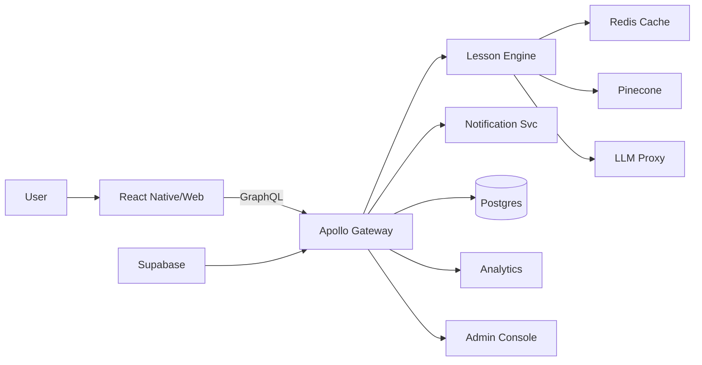

# Dev‑Ready Build Spec – AI‑Skills Micro‑Learning Chat

*Version 1.0 · Updated 19 July 2025*

---

## 1. What We’re Building (Scope v1)

- **Clients:** React Native app + PWA web shell
- **Core Services:** GraphQL Gateway, Lesson Engine, LLM Proxy, Notification Svc, Analytics, Admin Console
- **Data:** Postgres primary, Redis cache, Pinecone vector DB
- **Compliance:** SOC 2 roadmap, ≤ \$0.015 variable cost per 5‑min session

## 2. High‑Level Diagram



## 3. Component Owners & Stack

| Module            | Stack / Infra                           | Owner       |
| ----------------- | --------------------------------------- | ----------- |
| Client App        | React Native, Expo, PWA                 | Frontend    |
| GraphQL Gateway   | Node.js, Apollo‑Server, Helm            | Platform    |
| Lesson Engine     | Node.js, Redis, BullMQ                  | Backend     |
| LLM Proxy         | FastAPI + Letta + Gemini                | ML Platform |
| Notification Svc  | Firebase/APNs, CronJobs                 | Growth Eng  |
| Vector Memory     | Pinecone                                | ML Platform |
| Auth & Compliance | Supabase Auth                           | Security    |
| Billing           | Stripe                                  | Finance Eng |
| Analytics         | PostHog, Segment                        | Data        |
| Admin Console     | Next.js, tRPC                           | Enterprise  |

## 4. API Contracts (key endpoints)

```graphql
query getDailyLesson(userId: ID!): LessonStep!
mutation submitQuiz(stepId: ID!, answers: JSON!): QuizFeedback!
mutation switchTone(lessonId: ID!, tone: Tone!): LessonStep!
mutation submitProject(projectId: ID!, payload: JSON!): ProjectScore!
mutation shareBadge(trackId: ID!): ShareLink!
```

## 5. DB Schema Deltas

- **users**: add `role`, `tone`, `streak`
- **lesson\_progress**: (`user_id`, `lesson_id`, `step`, `status`, `updated_at`)
- **mini\_project\_submissions**: (`id`, `user_id`, `project_id`, `payload`, `score`)
- **certificates**: (`id`, `user_id`, `track_id`, `issued_at`)

> Migrations handled via Flyway ⇢ staging ⇢ 5 % canary ⇢ prod.

## 6. Non‑Functional Targets

| Metric (P99 unless stated) | Target    | Notes          |
| -------------------------- | --------- | -------------- |
| Lesson start latency       | ≤ 2 s     | incl. network  |
| Grading turnaround         | ≤ 30 s    | async batch OK |
| Availability               | ≥ 99.9 %  | multi‑AZ K8s   |
| Cost / session             | ≤ \$0.015 | tokens + infra |

## 7. Validation & CI/CD

- **Unit ≥ 80 %** on Lesson Engine & GraphQL resolvers
- **E2E:** Cypress smoke (onboarding ➞ lesson ➞ badge)
- **Load:** k6 10 k concurrent lesson starts; hold P99 SLA
- **CI:** GitHub Actions → Staging → Canary 5 % → Full Prod
- **Feature Flags:** LaunchDarkly «spaced repetition», «multi‑model routing»

## 8. Observability

- **Tracing:** OpenTelemetry IDs across services
- **Dashboards:** Grafana (latency/errors), PostHog (streaks)
- **Alerts:**
  - Lesson start P99 > 3 s for 5 min
  - Error‑rate > 2 % over 5 min

## 9. Roll‑out & Rollback

- **Blue/Green + Mobile Phased** (5 % ➞ 25 % ➞ 100 %)
- **Auto‑rollback:** if error‑rate ≥ 2 % OR P99 ≥ 500 ms for 5 min

## 10. Open Items

1. Confirm localization order (ES, PT‑BR).
2. Decide on Q4 multi‑model add (Claude 3, Gemini 2).
3. Finalize avatar animation pipeline.

---

*End of dev‑ready spec. If it’s not here, it’s not v1.*

